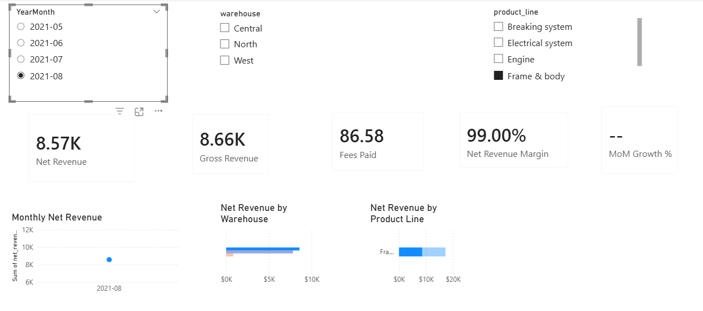

# Motorcycle Parts Sales Analytics (SQL + Power BI)

## Overview
Analyzed wholesale motorcycle parts sales to evaluate monthly revenue performance across 3 warehouses and multiple product lines. Calculated net revenue after payment processing fees and implemented time-based performance metrics.

## Tech Stack
- PostgreSQL (SQL views, aggregation, data modeling)
- Power BI (DAX, dashboard development)

## Key Metrics
- Gross Revenue
- Net Revenue (After Fees)
- Revenue Margin
- Month-over-Month Growth
- Warehouse & Product Line Performance

## Data Model
1. `sales_raw` – staging table
2. `v_sales` – cleaned transformation view
3. `v_monthly_wholesale` – aggregated reporting view used in BI

## Dashboard Preview

